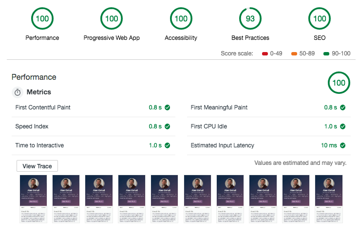

# alexoxrud.com
The goal of this project was to have a web presence as a developer and also demonstrate some best practices in order to deliver a fast experience.
I've kept it as simple as possible by using pug as the html preprocessor and feeding it data from a regular json file.

Report from [Google Lighthouse](https://developers.google.com/web/tools/lighthouse/):

## Dependencies
- node
- npm
- node-sass

## Installation
`npm install`

## Running for development
`npm start`

The gulp task runner will compile all the assets and move them into `public/`, it will then start a web server that serves those assets.
All changes to the source will be automatically compiled and the browser will be refreshed.

## Building assets for deployment
`npm run build`
